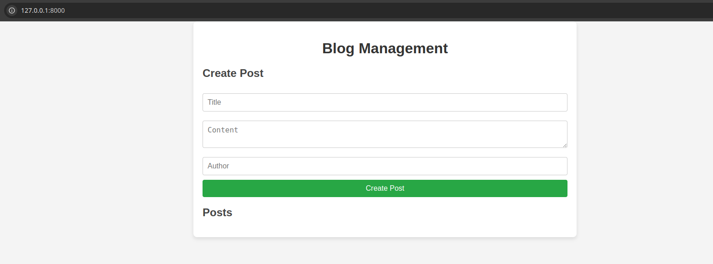
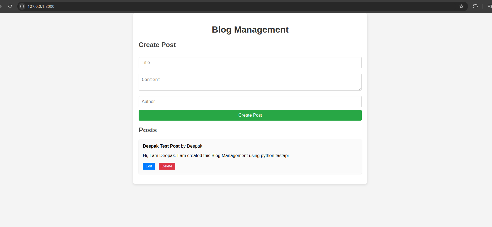
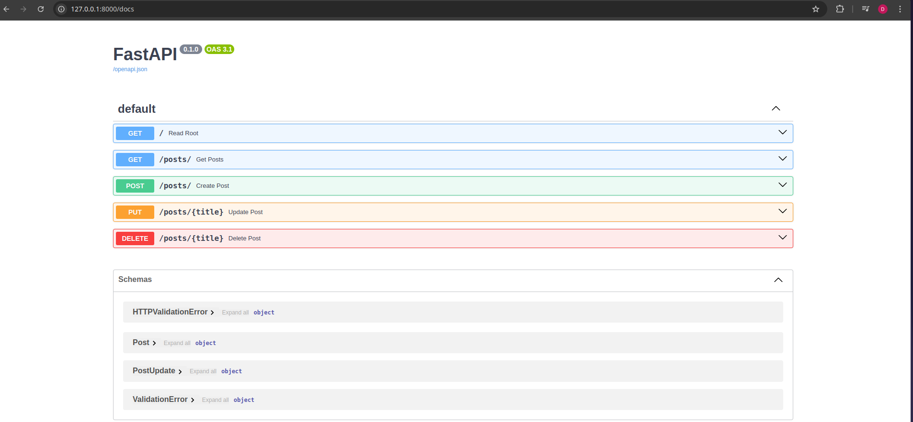

# To run the python application

- Create Virtual Env using python 3.12.3
- python -m venv blogenv
- source tenv/bin/activate

- Install the required python package
- pip install -r req.txt

- Run the application -> uvicorn main:app --reload

# To run using docker

- docker build -t blog:1 .
- docker run -dit -p 8000:8000 --name blog blog:1

# To access it

- localhost:8000